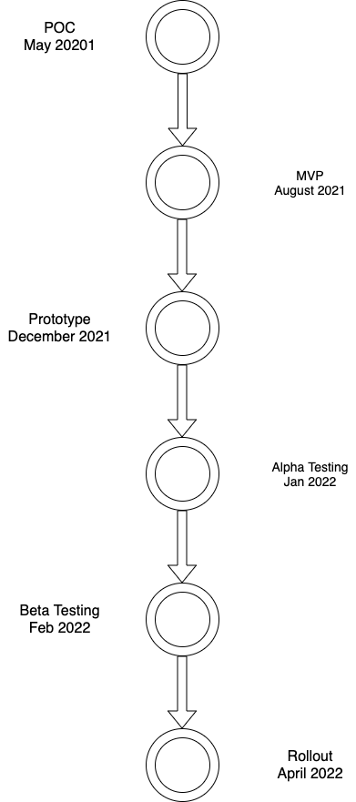

# BCDV1014 DAPP2 Final project documentation

** Made by Shivam Rattan (101339648) for prof. Dave Mckay's and Dhruvin Parikh's class **  

# Better Credit Bureau (BCB) - a hyperledger blockchain approach to credit monitoring

## About the project

In North America, everything from a car to a coffee is procured using credit. Specifically in Canada, there are 2 credit bureaus - Equifax and Transunion and 3 major credit card providers - Visa, MasterCard, and American Express. Both of the credit bureaus operate independently of each other, which implies that borrowers in Canada have 2 credit scores. The world doesn't function any differently, financial borrowing industry has been operating in silos despite the connected world that we live in. This complexity grows multifold as soon as more than one country comes into the picture. 

The project is a reimagination of the credit bureau system using hyperledger blockchain technology that uses channels to connect and streamline different credit bureaus within Canada. Since the hyperledger technology offers a peak transaction throughput of 12,000 transactions per second, and the involved parties (lenders and the bureaus) are the same worldwide, the system is highly scalable and offers global plug and play support.

### Solution Architecture and Proof of Concept

The solution being proposed offers an interconnected blockchain ledger and a localised couchDB, leveraging hyperledger fabric blockchain technology. The solution is acronymed BCB - better credit bureau. There are 3 main components of this BCB architecture:

**Hyperledger Fabric**  
Blockchain as a backend where information about credit cards and credit scores can be stored according to the data and parameters specified below. Current implementation uses channel 0 for the interconnection of BCB nodes, and distributed nodes with VISA, MasterCard, and AMEX for the proof of concept. The project can be scaled to use different channels for different credit card providers and country specific get methods for fetching credit information.

**Express API**  
Express.js is the API endpoint for BCB to connect to a cloud-based instance of Hyperledger Fabric. For MVP, the instance is based on a GCP, but can be implemented on AWS and Azzure as the solution is scaled in different countries. Additionally, the cloud-based instance would most likely be shifted from a virtual machine to a cloud-based kubernetes cluster.

**React**  
ReactJS is the preferred choice for the front end of the POC for BCB, as it offers a comprehensive boilerplate for creating optimum user experience for all sort of users including PC and Mobile. In the future, different countries can create their own UIs as per their preferences.

### Business valuation
BCB is fully scalable and flexible, and therefore can either be implemented individually in Canada, and the rest of the world, provided the government regulations are adhered to. Alternatively the technology is significantly similar to the likes of Equifax, Transunion and Experian, and can be acquired by these for global penetration. Since the hyperledger fabric technology is fast, and has been proven to provide the best of blockchain and traditional DBMS, the first beta version of this project is valued at $20 million easily.

### Project Development timeline

### Project Presentation
[here](https://github.com/shivamrulz/BCB-Better_Credit_Bureau/raw/main/Files/6.%20Better%20Credit%20Bureau%20-%20Shivam.pptx)

## Technical Details (PoC)

The section discusses the technical parameters and user stories, models the class diagram, and describes the functions for the POC.

//

Function description of the project is given as:
| **Function Name**      | **Function Parameters**                                        | **Function actions**                                                                                                                                                                                                                                                                  |
| ---------------------- | -------------------------------------------------------------- | ------------------------------------------------------------------------------------------------------------------------------------------------------------------------------------------------------------------------------------------------------------------------------------- |
| getUserInfo()          | Int creditCardNumber                                           | Used by the chain code admin/ BCB to get more information about the credit card holder’s information.

Primarily returns the information about the user such as his address, credit card info and a file that he has in a particular country                                          |
| getCreditFileDetails() | Int creditFileID                                               | Displays various historic information about user’s credit card file.

Used by BCB to do a ‘signup check’ upon onboarding a new user.

Also used by credit lenders upon doing a hard credit check to understand and validate spending habits of the user.                              |
| getUserCreditScore     | str creditBureauName, int creditFileID, bool monitoringService | A checking function to quickly check the credit score of a user

Can be used by credit score monitoring services such as Borrowell and Credit Karma to do a soft check for monitoring credit score of the user.                                                                       |
| setUSerCreditScore     | int creditFileID, str creditFileCountry                        | Used for forking a user credit report once a registration request to BCB is made via lenders.

The key feature of the BCB system that allows for moving credit scores and history internationally

This function calls getCredit\* functions in the backend for the mirroring process |
| checkcreditFileExists  | Str cardHolderName, intCardNumber, intcreditFileID             | A function that returns a binary yes or a no as a result of a global lookup of creditFiles to find a possible hit.

The hit is defined in this context as a situation where a user is already registered with BCB in a partner BCB country.                                           |
Class Diagram:

